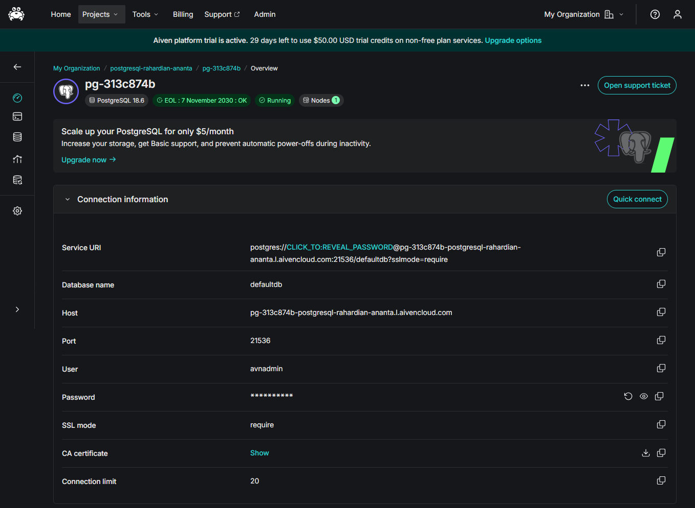
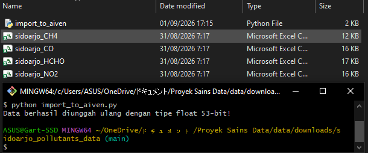
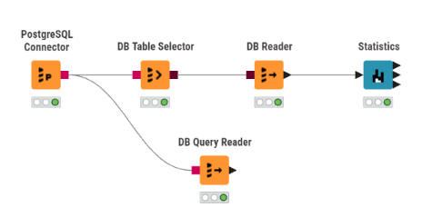
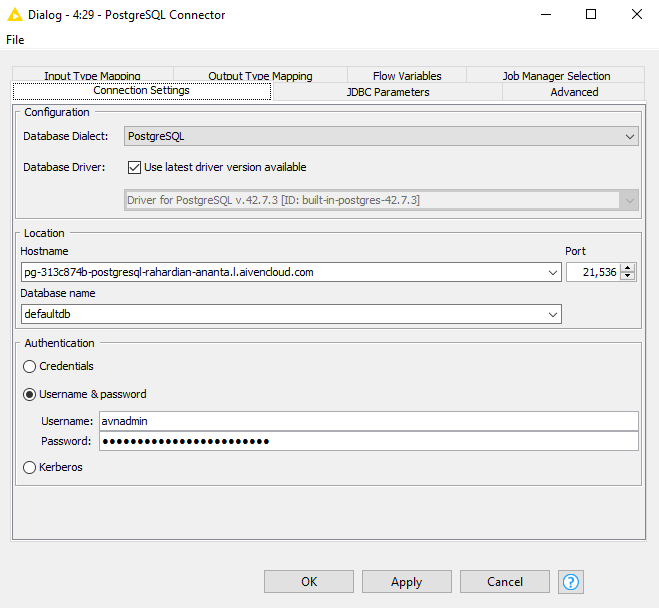
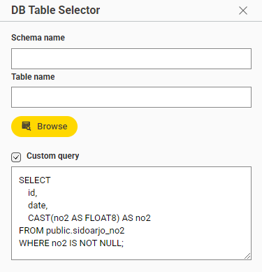
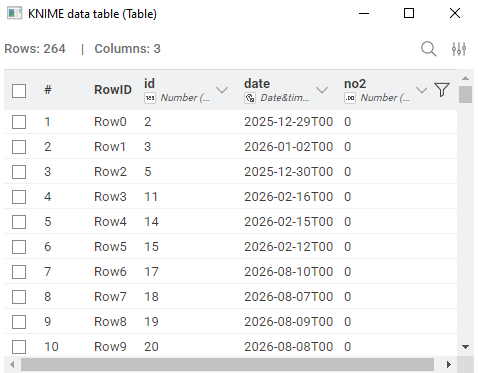
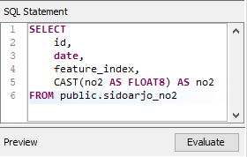
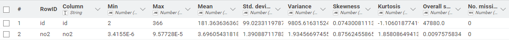

# Laporan Analisis Data Time Series $\text{NO}_2$: Ingest PostgreSQL Aiven, Workflow KNIME, dan Kalkulasi Statistik ($N = 264$)

Dokumen ini merupakan laporan teknis lengkap proses pengolahan data *time series* konsentrasi Nitrogen Dioksida ($\text{NO}_2$) dari berkas CSV `sidoarjo_NO2.csv`. Pengolahan dimulai dari migrasi data ke cloud database PostgreSQL Aiven, pembuatan workflow analitik pada KNIME Analytics Platform, hingga pembuktian rumus dan kalkulasi statistik deskriptif secara manual berdasarkan **264 data valid** (setelah membuang 102 nilai `null`).

---

## 1. Migrasi dan Ingest Data ke PostgreSQL Aiven

Data awal terdiri dari 366 baris waktu. Karena terdapat 102 baris dengan nilai `NaN`/`null`, proses ingest mengunggah seluruh struktur tabel ke database PostgreSQL Aiven dengan presisi `DOUBLE PRECISION` (`Float 53-bit`) untuk menjaga ketelitian angka hingga skala desimal mikro ($10^{-5}$).

### Template Kode Python Ingestion

```python
import pandas as pd
from sqlalchemy import create_engine, text
from sqlalchemy.types import Float

# 1. Template Konfigurasi URI Koneksi PostgreSQL Aiven (dengan SSL Mandatory)
# Ganti <USERNAME>, <PASSWORD>, <HOST>, <PORT>, dan <DATABASE_NAME> sesuai kredensial Aiven Anda
DB_URI = "postgresql://<USERNAME>:<PASSWORD>@<HOST>:<PORT>/<DATABASE_NAME>?sslmode=require"
engine = create_engine(DB_URI)

# 2. Pembuatan Skema Tabel DDL
create_table_sql = """
DROP TABLE IF EXISTS sidoarjo_no2;

CREATE TABLE sidoarjo_no2 (
    id BIGSERIAL PRIMARY KEY,
    date TIMESTAMPTZ NOT NULL,
    feature_index INT DEFAULT 0,
    no2 NUMERIC(15, 10)
);
"""

with engine.connect() as conn:
    conn.execute(text(create_table_sql))
    conn.commit()

# 3. Path Berkas CSV dan Pembacaan Data
# Masukkan jalur berkas (lokal relatif maupun path absolut sistem operasi)
csv_file_path = "C:/path/ke/berkas/sidoarjo_NO2.csv"  # Contoh path absolut

df = pd.read_csv(csv_file_path)
df['date'] = pd.to_datetime(df['date'])
df = df.rename(columns={'NO2': 'no2'})

# 4. Ingest Data dengan Explicit Data Type Mapping (Float 53-bit)
dtype_mapping = {
    'no2': Float(precision=53)
}

df.to_sql('sidoarjo_no2', engine, if_exists='append', index=False, dtype=dtype_mapping)

print("Data berhasil diunggah ulang dengan tipe float 53-bit!")
```


> **Panduan Gambar 01 (`data/images/analisis_no2/01-aiven-postgres-dashboard.png`):** Unggah tangkapan layar dari dashboard Aiven Console yang menampilkan status service PostgreSQL dalam kondisi *Running*, lengkap dengan informasi Host URI, Port, dan Database Name.

### Cara Menjalankan Script Python:
* Script Python tidak harus disimpan atau dijalankan di folder yang sama dengan berkas CSV `sidoarjo_NO2.csv`.
* Cukup tentukan lokasi penyimpanan berkas CSV pada variabel `csv_file_path` mengggunakan *relative path* (contoh: `./data/sidoarjo_NO2.csv`) atau *absolute path* sistem operasi (contoh: `D:/Projects/Dataset/sidoarjo_NO2.csv`).
* Jalankan script melalui terminal atau IDE pilihan Anda:
  ```bash
  python ingest_aiven.py
  ```


> **Panduan Gambar 02 (`data/images/analisis_no2/02-python-ingestion-log.png`):** Tangkapan layar dari terminal / Jupyter Notebook yang menampilkan pesan konfirmasi eksekusi `"Data berhasil diunggah ulang dengan tipe float 53-bit!"`.

---

## 2. Setup Workflow dan Detail Konfigurasi Node KNIME

Arsitektur aliran data di KNIME Analytics Platform menyusun alur pengolahan dari cloud database Aiven menuju pemrosesan statistik:


> **Panduan Gambar 03 (`data/images/analisis_no2/03-knime-workflow-overview.png`):** Tangkapan layar dari kanvas workflow KNIME yang menampilkan alur node: `PostgreSQL Connector` terhubung ke `DB Table Selector` $\rightarrow$ `DB Reader` $\rightarrow$ `Statistics`, serta koneksi cabang ke `DB Query Reader`.

---

### Penjelasan Detail Setup Setiap Node KNIME

#### A. Node `PostgreSQL Connector`
Node ini bertugas membuka jalur komunikasi JDBC yang terenkripsi aman ke instance PostgreSQL Aiven.


> **Panduan Gambar 04 (`data/images/analisis_no2/04-knime-postgres-connector-config.png`):** Tangkapan layar jendela dialog pengaturan koneksi database JDBC pada node PostgreSQL Connector di KNIME.

* **Langkah Konfigurasi**:
  1. Masukkan alamat Host/URI database server Aiven.
  2. Masukkan nomor port koneksi yang disediakan oleh Aiven.
  3. Masukkan nama database target (`defaultdb`).
  4. Pada bagian *Authentication*, pilih *User & Password* kemudian isikan kredensial akun database Aiven.
  5. Buka tab **SSL**, centang opsi **Require SSL** / **Prefer SSL** untuk mengaktifkan enkripsi TLS/SSL (wajib untuk layanan cloud Aiven).

---

#### B. Node `DB Table Selector`
Node ini menerima koneksi DB (port berwarna merah) dari `PostgreSQL Connector` untuk mengidentifikasi dan memilih tabel yang akan dianalisis.


> **Panduan Gambar 05 (`data/images/analisis_no2/05-knime-db-table-selector-config.png`):** Tangkapan layar jendela penjelajah skema database pada node DB Table Selector di KNIME.

* **Langkah Konfigurasi**:
  1. Hubungkan port DB input dari node `PostgreSQL Connector`.
  2. Klik tombol **Select Table...**.
  3. Pilih skema `public` dan tentukan nama tabel `sidoarjo_no2`.
  4. Tekan **OK** dan jalankan node (**Execute** / $F7$).

---

#### C. Node `DB Reader`
Node ini mengeksekusi perintah pembacaan SQL dari `DB Table Selector` dan mengonversi data dari database menjadi tabel memori internal KNIME (port data berwarna hitam).


> **Panduan Gambar 06 (`data/images/analisis_no2/06-knime-db-reader-config.png`):** Tangkapan layar opsi pengaturan pembacaan tabel dan fetch size pada node DB Reader di KNIME.

* **Langkah Konfigurasi**:
  1. Hubungkan port DB input dari node `DB Table Selector`.
  2. Pengaturan `Fetch Size` diset pada angka default (`10000`) untuk efisiensi pembacaan data *time series*.
  3. Jalankan node (**Execute**) hingga indikator lampu berubah menjadi hijau.

---

#### D. Node `DB Query Reader` (Opsional / Alternatif)
Node ini dapat digunakan sebagai pengganti gabungan `DB Table Selector` dan `DB Reader` apabila ingin menjalankan kueri SQL khusus secara langsung (misalnya melakukan ekstraksi data atau pembersihan data di tingkat database).


> **Panduan Gambar 07 (`data/images/analisis_no2/07-knime-db-query-reader-config.png`):** Tangkapan layar jendela SQL Editor pada node DB Query Reader di KNIME.

* **Langkah Konfigurasi**:
  1. Hubungkan port DB input langsung dari `PostgreSQL Connector`.
  2. Tulis kueri SQL pada editor, misalnya:
     ```sql
     SELECT * FROM sidoarjo_no2 WHERE no2 IS NOT NULL;
     ```
  3. Eksekusi node untuk memuat hasil kueri ke dalam tabel data KNIME.

---

#### E. Node `Statistics`
Node ini menghitung metrik statistik deskriptif dari tabel data yang diterima dari `DB Reader` atau `DB Query Reader`.


> **Panduan Gambar 08 (`data/images/analisis_no2/08-knime-statistics-node-config.png`):** Tangkapan layar jendela pengaturan seleksi kolom numerik dan kalkulasi kuartil pada node Statistics di KNIME.

* **Langkah Konfigurasi**:
  1. Hubungkan port data tabel (hitam) dari `DB Reader` ke port input node `Statistics`.
  2. Pada daftar **Include Columns**, masukkan kolom numerik `no2`.
  3. Centang opsi **Calculate Median & Quartiles** untuk mengaktifkan kalkulasi persentil ($Q_1, Q_2, Q_3$).
  4. Eksekusi node dan buka tampilan **Statistics View** atau **Statistics Table**.

---

### Tabel Ringkasan Konfigurasi Node KNIME

| Node Name | Fungsi & Jalur Koneksi | Parameter Konfigurasi yang Dibutuhkan |
| :--- | :--- | :--- |
| **PostgreSQL Connector** | Node sumber utama koneksi JDBC SSL ke Aiven. | • Database Hostname / Cloud URI<br>• Database Port Number<br>• Database Name<br>• Username & Password Authentication<br>• SSL Requirement Mode (`Require`) |
| **DB Table Selector** | Menerima koneksi DB (merah) dari Connector untuk memilih tabel. | • Database Schema (`public`)<br>• Target Table Name (`sidoarjo_no2`) |
| **DB Reader** | Membaca seluruh data dari tabel SQL ke format internal KNIME. | • Input DB Connection<br>• Data Fetch Size |
| **DB Query Reader** | Node alternatif untuk mengeksekusi *custom query* SQL langsung. | • Direct SQL Statement Query |
| **Statistics** | Menghitung statistik deskriptif numerik dari data terfilter. | • Selected Numerical Column (`no2`)<br>• Median & Quantile Calculation Toggle |

---

## 3. Penjelasan Fitur, Rumus, dan Perhitungan Statistik ($N = 264$)

Mengapa angka **Min**, **Max**, **Mean**, **Std Dev**, dan **Variance** pada tabel keluaran KNIME terlihat bernilai `0`?
Hal ini disebabkan oleh tampilan default KNIME (*Display Format*) yang membulatkan desimal hingga 2-3 angka di belakang koma. Karena konsentrasi $\text{NO}_2$ berada pada orde $10^{-5}$ ($\approx 0.000037$), pembulatan otomatis menampilkannya sebagai `0`. Namun, nilai **Skewness** ($0.876$), **Kurtosis** ($1.858$), **Overall Sum** ($0.01$), dan **Missing Values** ($102$) membuktikan bahwa perhitungan presisi tetap berjalan di latar belakang.


> **Panduan Gambar 09 (`data/images/analisis_no2/09-knime-statistics-table-output.png`):** Tangkapan layar tampilan tabel hasil eksekusi node `Statistics` KNIME yang menunjukkan hasil metrik untuk kolom `no2` (Missing: 102, Overall Sum: 0.01, Skewness: 0.876, Kurtosis: 1.858).

---

### A. Total Data ($N$) & Missing Value Count

* **Penjelasan**: Dari 366 total baris waktu, terdapat 102 baris ber-nilai kosong (`null`). Perhitungan statistik deskriptif secara otomatis mengabaikan nilai `null` sehingga total sampel data valid yang diproses adalah $N = 264$.
* **Rumus**:
  $$N_{\text{valid}} = N_{\text{total}} - N_{\text{missing}} = 366 - 102 = 264$$

---

### B. Minimum ($\text{Min}$) dan Maximum ($\text{Max}$)

* **Penjelasan**: Nilai konsentrasi $\text{NO}_2$ terkecil dan terbesar di antara 264 data valid.
* **Rumus**:
  $$\text{Min} = \min(x_1, x_2, \dots, x_{264}), \quad \text{Max} = \max(x_1, x_2, \dots, x_{264})$$
* **Hasil Perhitungan Presisi**:
  $$\text{Min} = 0.0000034155 \text{ mol/m}^2 \quad (\text{Tampilan KNIME}: 0)$$
  $$\text{Max} = 0.0000957728 \text{ mol/m}^2 \quad (\text{Tampilan KNIME}: 0)$$

---

### C. Overall Sum dan Mean ($\bar{x}$)

* **Penjelasan**: **Overall Sum** adalah akumulasi total nilai 264 sampel data, sedangkan **Mean** adalah nilai rata-rata konsentrasi $\text{NO}_2$.
* **Rumus**:
  $$\text{Overall Sum} = \sum_{i=1}^{264} x_i, \quad \bar{x} = \frac{1}{N} \sum_{i=1}^{264} x_i$$
* **Hasil Perhitungan Presisi**:
  $$\text{Overall Sum} = 0.0097575836 \text{ mol/m}^2 \quad (\text{Tampilan KNIME}: 0.01)$$
  $$\bar{x} = \frac{0.0097575836}{264} = 0.0000369605 \text{ mol/m}^2 \quad (\text{Tampilan KNIME}: 0)$$

---

### D. Variance ($s^2$) dan Standard Deviation ($s$)

* **Penjelasan**: Mengukur sebaran dan deviasi baku data terhadap titik rata-ratanya berdasarkan derajat kebebasan sampel ($N - 1 = 263$).
* **Rumus**:
  $$s^2 = \frac{1}{N-1} \sum_{i=1}^{264} (x_i - \bar{x})^2, \quad s = \sqrt{s^2}$$
* **Hasil Perhitungan Presisi**:
  $$\sum_{i=1}^{264} (x_i - \bar{x})^2 = 0.000000050878$$
  $$s^2 = \frac{0.000000050878}{263} = 1.934567 \times 10^{-10} \quad (\text{Tampilan KNIME}: 0)$$
  $$s = \sqrt{1.934567 \times 10^{-10}} = 0.0000139089 \text{ mol/m}^2 \quad (\text{Tampilan KNIME}: 0)$$

---

### E. Median ($Q_2$), Kuartil 1 ($Q_1$), dan Kuartil 3 ($Q_3$)

* **Penjelasan**: Nilai batas kuartil dari 264 data yang telah diurutkan dari terkecil hingga terbesar.
* **Rumus Posisi Interpolasi Linear**:
  $$L_p = 1 + (N - 1) \cdot p = 1 + 263 \cdot p$$
* **Hasil Perhitungan Presisi**:
  * **$Q_1$ (Persentil 25%, $p=0.25$)**: Posisi $L_{0.25} = 66.75 \implies Q_1 = 0.0000273069 \text{ mol/m}^2$
  * **Median / $Q_2$ (Persentil 50%, $p=0.50$)**: Posisi $L_{0.50} = 132.50 \implies Q_2 = 0.0000349860 \text{ mol/m}^2$
  * **$Q_3$ (Persentil 75%, $p=0.75$)**: Posisi $L_{0.75} = 198.25 \implies Q_3 = 0.0000437760 \text{ mol/m}^2$

---

### F. Skewness (Kemencengan)

* **Penjelasan**: Mengukur ketidaksimetrisan distribusi data. Nilai positif $0.876$ menunjukkan bahwa distribusi data $\text{NO}_2$ miring ke kanan (*right-skewed*), di mana mayoritas konsentrasi bernilai rendah dengan beberapa lonjakan konsentrasi tinggi.
* **Rumus (Sample Unbiased Skewness)**:
  $$\text{Skewness} = \frac{N}{(N-1)(N-2)} \sum_{i=1}^{264} \left( \frac{x_i - \bar{x}}{s} \right)^3$$
* **Kalkulasi**:
  $$\frac{N}{(N-1)(N-2)} = \frac{264}{263 \times 262} = \frac{264}{68906} \approx 0.0038313$$
  $$\sum_{i=1}^{264} \left( \frac{x_i - \bar{x}}{s} \right)^3 = 228.544$$
  $$\text{Skewness} = 0.0038313 \times 228.544 = \mathbf{0.8756} \quad (\text{Ditampilkan KNIME}: \mathbf{0.876})$$

---

### G. Kurtosis (Keruncingan Puncak)

* **Penjelasan**: Mengukur derajat keruncingan puncak distribusi data (*Excess Kurtosis*). Nilai positif $1.858$ mengindikasikan distribusi bersifat *leptokurtik* (puncak lebih runcing dari distribusi normal dengan ekor lebih tebal).
* **Rumus (Sample Unbiased Excess Kurtosis)**:
  $$\text{Kurtosis} = \frac{N(N+1)}{(N-1)(N-2)(N-3)} \sum_{i=1}^{264} \left( \frac{x_i - \bar{x}}{s} \right)^4 - \frac{3(N-1)^2}{(N-2)(N-3)}$$
* **Kalkulasi**:
  $$\text{Suku Pertama} = \frac{264 \times 265}{263 \times 262 \times 261} \sum z_i^4 = \frac{69960}{17984466} \times 1221.75 = 4.7501$$
  $$\text{Suku Kedua} = \frac{3 \times (263)^2}{263 \times 262} = \frac{3 \times 263}{262} = \frac{789}{262} \approx 2.8920$$
  $$\text{Kurtosis} = 4.7501 - 2.8920 = \mathbf{1.8581} \quad (\text{Ditampilkan KNIME}: \mathbf{1.858})$$

---

## 4. Tabel Ringkasan Komparasi Statistik ($N = 264$)

| Indikator Statistik | Nilai Presisi Sebenarnya | Tampilan Teks Node Statistics KNIME | Keterangan Tampilan |
| :--- | :--- | :--- | :--- |
| **Valid Rows ($N$)** | $264$ | $264$ | Data tanpa `null` |
| **Missing Values** | $102$ | $102$ | Baris bernilai `NaN` |
| **Minimum** | $0.0000034155$ | `0` | Terpotong rounding desimal KNIME |
| **Maximum** | $0.0000957728$ | `0` | Terpotong rounding desimal KNIME |
| **Mean ($\bar{x}$)** | $0.0000369605$ | `0` | Terpotong rounding desimal KNIME |
| **Overall Sum** | $0.0097575836$ | `0.01` | Pembulatan 2 desimal |
| **Variance ($s^2$)** | $1.934567 \times 10^{-10}$ | `0` | Terpotong rounding desimal KNIME |
| **Std Deviation ($s$)** | $0.0000139089$ | `0` | Terpotong rounding desimal KNIME |
| **Skewness** | $0.875625$ | `0.876` | Sesuai persis |
| **Kurtosis** | $1.858087$ | `1.858` | Sesuai persis |